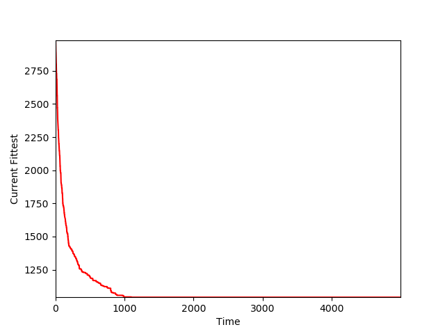
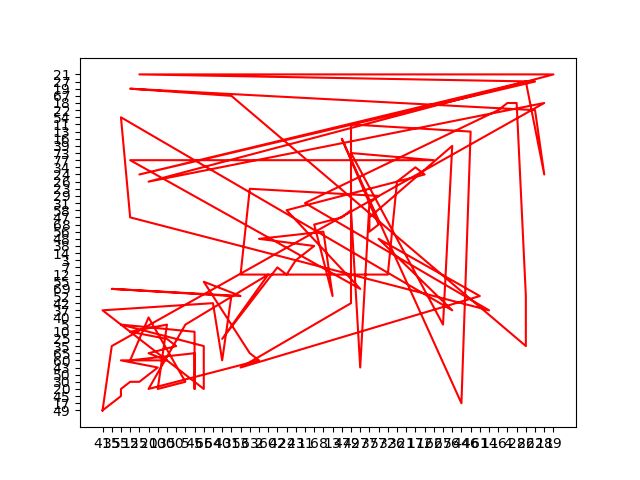
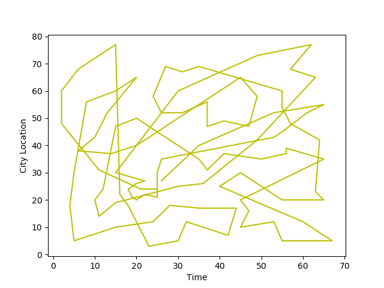

# Generic Algortihm TSP Solving GA
This repository includes the use of genetic algorithm to solve the roaming problem and its graphical representation.
Result n_generation for 5000 
Current Fittest-Time graph

  

First random-way

  

Result

  

